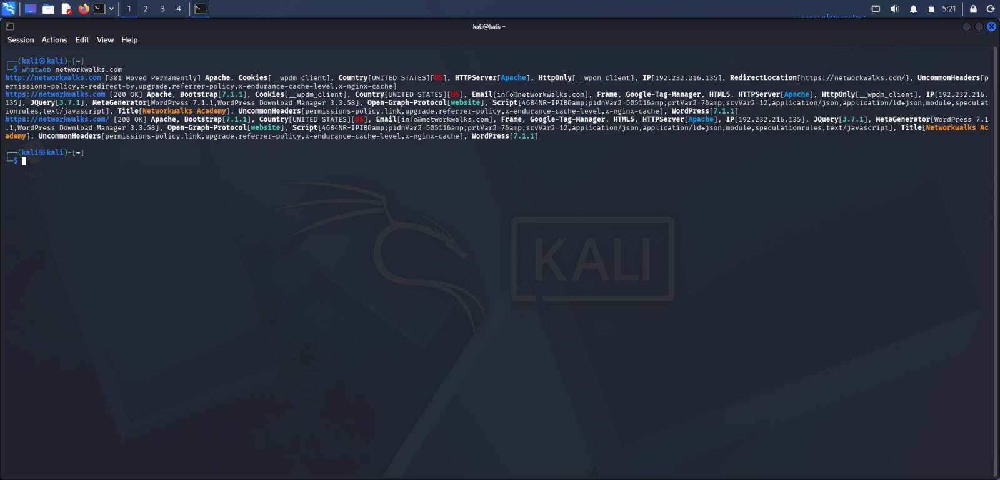
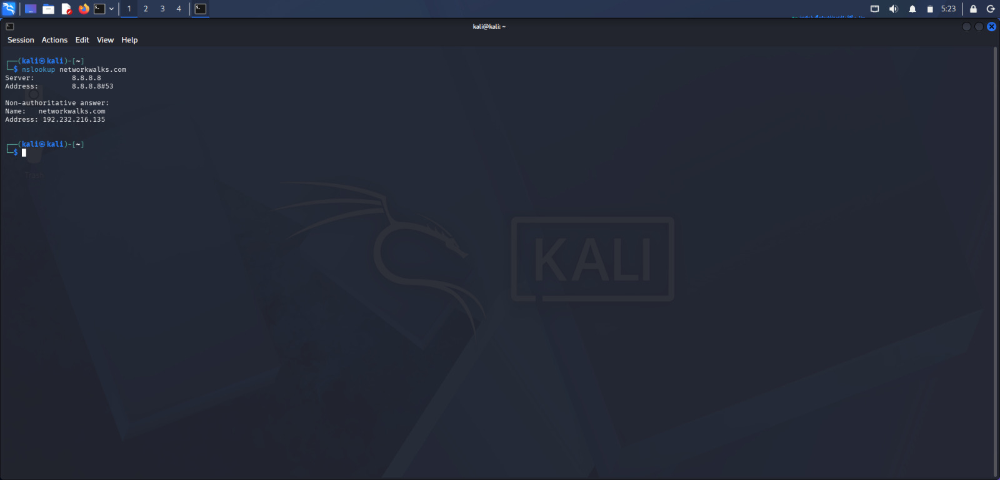
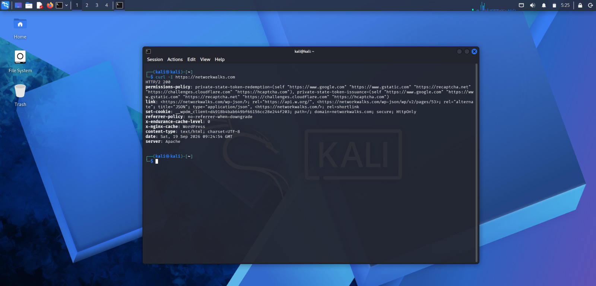
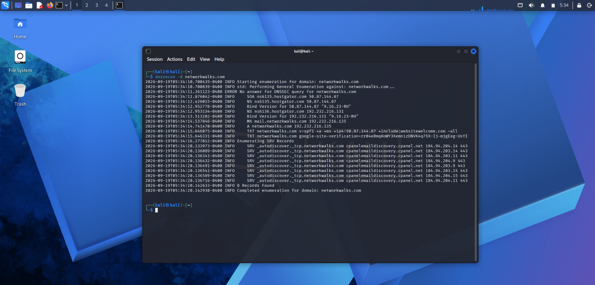
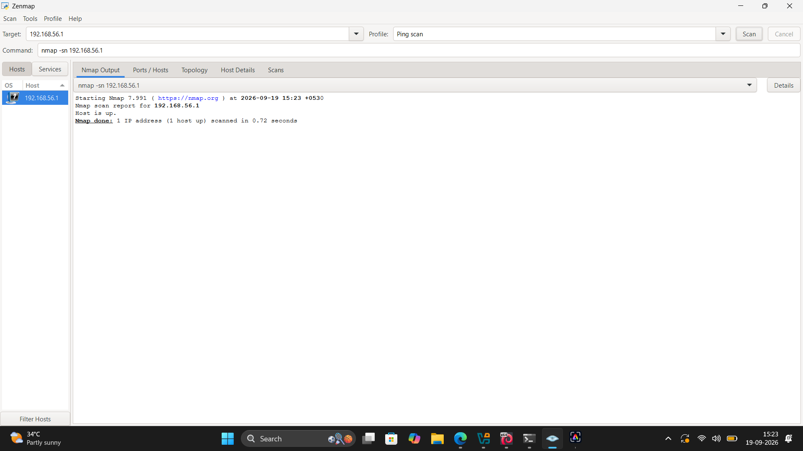

# Week 2 — Footprinting & Network Scanning

## Reconnaissance with Kali Linux and Network Discovery with Zenmap

---

## Project Overview

This project was completed as part of **Week 2 of the Cybersecurity Program at Networkwalks**.

The project covers two major cybersecurity activities:

1. **Footprinting & Reconnaissance using Kali Linux**
2. **Network Scanning using Zenmap**

The footprinting activity focused on collecting publicly available information about the `networkwalks.com` domain using multiple reconnaissance tools.

The network scanning activity focused on performing a Ping Scan against an authorized local network target using Zenmap and identifying whether the target host was active.

These activities demonstrate the reconnaissance and network discovery stages of a basic penetration testing workflow.

---

## Objectives

The main objectives of this project were to:

* Perform domain footprinting using Kali Linux tools.
* Collect publicly available domain registration information.
* Identify web technologies used by a website.
* Resolve a domain name to its IP address.
* Inspect HTTP response headers.
* Identify the presence of a Web Application Firewall.
* Enumerate DNS records.
* Perform network discovery using Zenmap.
* Identify whether an authorized local host is active.
* Document observations and security considerations.
* Prepare a basic penetration testing report.

---

## Scope & Ethical Use

All activities in this project were performed as part of an authorized cybersecurity learning activity.

The footprinting activity was performed against the `networkwalks.com` domain as part of the assigned practical exercise.

The Zenmap scanning activity was performed against an authorized local network target.

The activities were limited to reconnaissance and network discovery. No exploitation or unauthorized access was performed.

> Reconnaissance and scanning should only be performed against systems and networks where appropriate authorization has been provided.

---

# Module 1 — Footprinting & Reconnaissance

## What is Footprinting?

Footprinting, also known as reconnaissance, is the process of collecting information about a target before performing further security testing.

During this activity, the following Kali Linux tools were used:

| Tool     | Purpose                         |
| -------- | ------------------------------- |
| WHOIS    | Domain registration information |
| WhatWeb  | Web technology fingerprinting   |
| Nslookup | Domain-to-IP resolution         |
| Curl     | HTTP response header inspection |
| Wafw00f  | WAF detection                   |
| DNSRecon | DNS record enumeration          |

Each tool provides a different type of information and helps create an overall view of the publicly exposed infrastructure.

---

# 1. WHOIS

## Domain Registration Information

WHOIS was used to obtain publicly available registration information for the target domain.

### Information Observed

The WHOIS output provided information including:

* Domain name
* Registrar
* Domain creation date
* Domain expiry date
* Domain status
* Name servers
* DNSSEC status

The output showed that the domain was registered through **GoDaddy** and the name servers were associated with **HostGator**.

The WHOIS output also showed that DNSSEC was listed as unsigned.

### Evidence


---

# 2. WhatWeb

## Web Technology Fingerprinting

WhatWeb was used to identify technologies and services exposed by the target website.

### Information Observed

The scan identified technologies including:

* Apache web server
* WordPress
* WordPress Download Manager
* jQuery
* Bootstrap
* Google Tag Manager
* Other HTTP and web technology information

The screenshot identified:

* WordPress version: `7.1.1`
* WordPress Download Manager: `3.3.58`

### Security Observation

Technology and version information can help security teams understand what software is publicly exposed.

This information alone does not confirm that the identified software is vulnerable.

### Evidence



---

# 3. Nslookup

## Domain to IP Resolution

Nslookup was used to resolve the domain name to its IP address.

### Information Observed

The DNS query returned:

```text
Name: networkwalks.com
Address: 192.232.216.135
```

The query was performed using Google's public DNS resolver.

### Security Observation

DNS resolution provides information about the infrastructure associated with a domain.

### Evidence



---

# 4. Curl

## HTTP Response Header Analysis

Curl was used to inspect the HTTP response headers returned by the website.

### Information Observed

The response included information such as:

* Apache web server information
* WordPress-related information
* HTTP security and policy headers
* Cache-related headers
* WordPress REST API references

The response exposed a WordPress REST API reference through:

```text
/wp-json/
```

### Security Observation

HTTP response headers can reveal useful technical information about a web application and its underlying technologies.

The presence of a REST API reference does not by itself indicate a vulnerability.

### Evidence



---

# 5. Wafw00f

## Web Application Firewall Detection

Wafw00f was used to determine whether the target website was protected by a Web Application Firewall.

### Information Observed

The tool identified:

```text
ModSecurity (SpiderLabs)
```

as the detected Web Application Firewall.

### Security Observation

The presence of a WAF indicates that a web application security control is deployed in front of the website.

The detection itself is not a vulnerability.

### Evidence


---

# 6. DNSRecon

## DNS Enumeration

DNSRecon was used to enumerate publicly available DNS information associated with the domain.

### Information Observed

The output contained information related to:

* SOA records
* NS records
* MX records
* A records
* TXT records
* SPF information
* SRV records
* DNS server information

The enumeration also showed service-related records associated with email discovery.

### Security Observation

DNS records can provide useful information about an organization's infrastructure and services.

Only required DNS records should be publicly exposed, and they should be reviewed periodically.

### Evidence



---

# Footprinting Summary

The footprinting activity demonstrated how publicly available information can reveal useful details about an organization's external infrastructure.

The tools provided information about:

* Domain registration
* Name servers
* Web technologies
* Server information
* IP address
* HTTP headers
* WAF technology
* DNS infrastructure

This information can help security professionals understand the external attack surface before conducting further authorized security testing.

---

# Module 5 — Network Scanning with Zenmap

## Project Overview

Zenmap is the graphical interface for Nmap and provides a user-friendly way to perform network discovery.

For this activity, Zenmap was used to perform a **Ping Scan** against an authorized local network target.

The objective was to determine whether the selected host was active.

---

# 1. Zenmap Ping Scan

A Ping Scan was performed using Zenmap.

### Target

```text
192.168.56.1
```

### Scan Profile

```text
Ping Scan
```

### Scan Result

The scan reported:

```text
Host is up.

Nmap done: 1 IP address (1 host up) scanned
```

The scan completed successfully in approximately `0.72 seconds`.

### Observation

The selected authorized local host was active and reachable during the scan.

The available screenshot represents the final Ping Scan result.

### Evidence



---

# Findings & Risk Analysis

The following observations were identified during the footprinting and network discovery activities.

| # | Finding / Observation                  | Evidence | Potential Impact                                                                  | Risk          |
| - | -------------------------------------- | -------- | --------------------------------------------------------------------------------- | ------------- |
| 1 | Web technology information exposed     | WhatWeb  | Technology information may assist further security assessment                     | Low           |
| 2 | Public IP address identifiable         | Nslookup | Provides information about publicly reachable infrastructure                      | Low           |
| 3 | Technical HTTP information exposed     | Curl     | May assist technology fingerprinting                                              | Low           |
| 4 | WAF technology identifiable            | Wafw00f  | Reveals information about deployed security architecture                          | Informational |
| 5 | DNS infrastructure information exposed | DNSRecon | Can help build an infrastructure profile                                          | Low           |
| 6 | DNSSEC shown as unsigned               | WHOIS    | May reduce protection against certain DNS-related risks depending on architecture | Informational |
| 7 | Authorized local host discovered       | Zenmap   | Confirms that the selected host was reachable during the scan                     | Informational |

> **Important:** These are observations from reconnaissance and network discovery. They are not confirmed exploitable vulnerabilities. No exploitation or vulnerability validation was performed as part of this project.

---

# Security Recommendations

Based on the observations from the activities, the following security practices are recommended.

### 1. Review Publicly Exposed Technology Information

Organizations should periodically review information about their CMS, plugins, frameworks and web servers that can be identified externally.

### 2. Keep Software Updated

CMS platforms, plugins and other web technologies should be kept updated and reviewed against relevant security advisories.

### 3. Review HTTP Response Headers

HTTP headers should be reviewed regularly to determine whether unnecessary technical information is being exposed.

### 4. Review DNS Records

DNS records should be periodically reviewed to ensure that only required records and services are publicly exposed.

### 5. Maintain WAF Protection

The detected WAF should remain properly configured, monitored and maintained.

### 6. Review DNS Security

The organization's DNS security requirements should be reviewed to determine whether additional DNS security controls are appropriate.

### 7. Perform Regular Network Discovery

Organizations should periodically review their own networks to identify active and authorized devices.

### 8. Investigate Unknown Devices

Unexpected devices discovered during authorized network discovery should be investigated and verified.

---

# What I Learned

Through this Week 2 project, I learned how reconnaissance and network discovery are used during a cybersecurity assessment.

### 1. Footprinting & Reconnaissance

I learned how publicly available information can reveal useful details about a target without performing exploitation.

### 2. Using Multiple Reconnaissance Tools

I learned that different tools provide different types of information:

* **WHOIS** → Domain registration information
* **WhatWeb** → Web technology fingerprinting
* **Nslookup** → IP address resolution
* **Curl** → HTTP response headers
* **Wafw00f** → WAF detection
* **DNSRecon** → DNS enumeration

### 3. Web Technology Fingerprinting

I learned how tools such as WhatWeb can identify technologies used by a website.

### 4. DNS Enumeration

I learned how DNS information can reveal infrastructure such as name servers, mail servers and service records.

### 5. Network Discovery

I learned how Zenmap can be used to determine whether an authorized host is active on a network.

### 6. Security Documentation

I learned how to document:

* What was tested
* What was observed
* What the observation means
* Potential security impact
* Recommended security practices

### 7. Authorized Testing

I learned that reconnaissance and scanning must always be performed within an authorized scope.

---

# Penetration Testing Report

A separate penetration testing report has been prepared based on the reconnaissance and network discovery activities performed during this project.

The report documents:

* Scope
* Objectives
* Methodology
* Reconnaissance observations
* Network scanning results
* Security observations
* Risk analysis
* Recommendations
* Limitations
* Conclusion

---

# Tools Used

* Kali Linux
* WHOIS
* WhatWeb
* Nslookup
* Curl
* Wafw00f
* DNSRecon
* Zenmap / Nmap

---

# ⚠️ Disclaimer

This project was completed for authorized cybersecurity education and practical learning.

The techniques documented in this repository should only be used against systems, applications and networks where explicit authorization has been provided.

No unauthorized access or exploitation was performed.

---

# 👤 Author

**Kishore B**

Cybersecurity Intern
Networkwalks Cybersecurity Program

---

## Project Information

| Field           | Details                                          |
| --------------- | ------------------------------------------------ |
| Program         | Networkwalks Cybersecurity Program               |
| Week            | 02                                               |
| Activities      | Footprinting & Reconnaissance + Network Scanning |
| Platform        | Kali Linux                                       |
| Network Scanner | Zenmap / Nmap                                    |
| Author          | Kishore B                                        |
